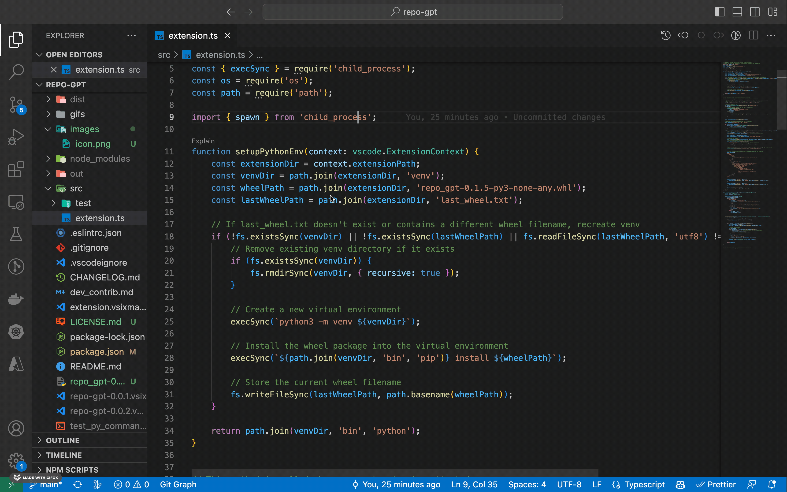
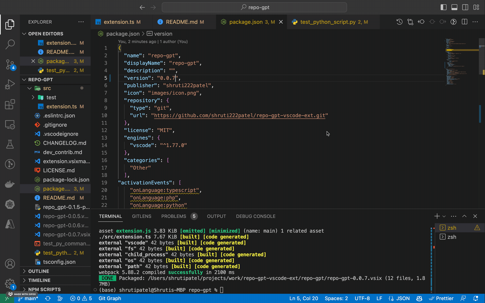

# repo-gpt
ALPHA RELEASE

Understand functions using the help of GPT with one click.

## Features
### Explain code

## Requirements

* This extension only works on Macs & Linux operating systems that have python 3.8+ installed.
* The following language are supported
  * python
  * typescript
  * php
  * sql

## Extension Settings

* `repogpt.openaiApiKey`: set the value as your openai api secret. 

## Known Issues

* Switching tabs after pressing explain will cause the explaination to disappear

## Release Notes

### 0.1.0

Alpha test of package

